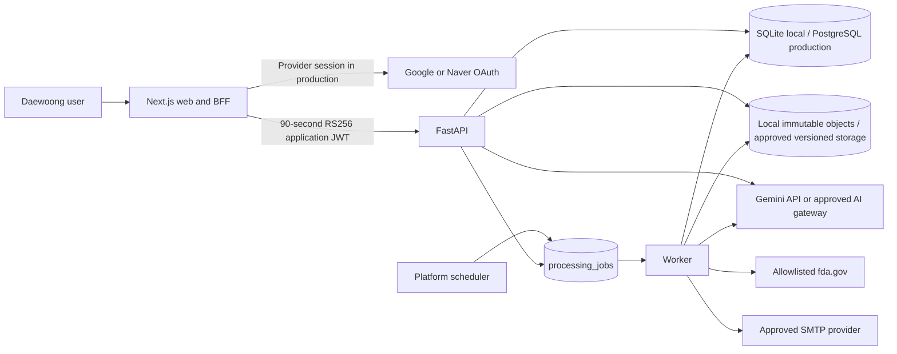
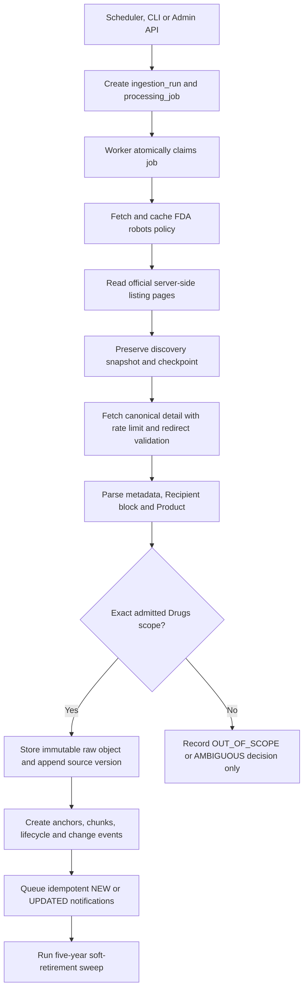
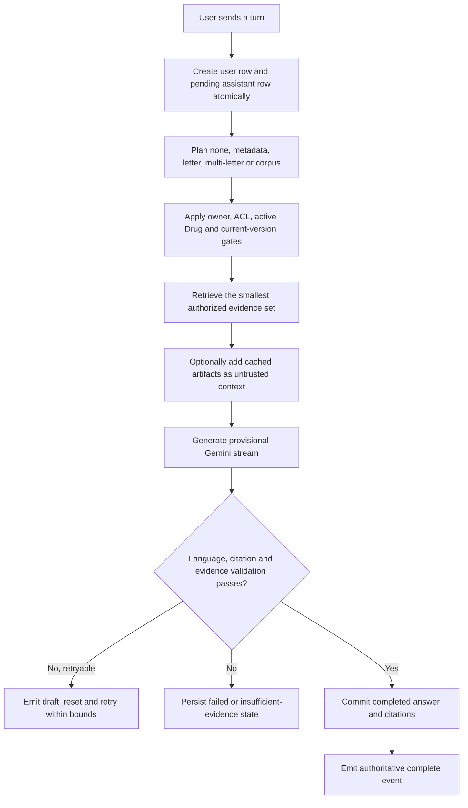

# Daewoong FDA Warning Letter Update - Service Handoff Guide

## Document control

| Field | Value |
| --- | --- |
| Purpose | Complete product, interface, backend, operations, and development handoff |
| Audience | Product, frontend, backend, data, platform, security, QA, and regulatory reviewers |
| Snapshot date | 2026-08-31 (Asia/Seoul) |
| Baseline branch | `main` |
| Baseline commit | `42b5e2f` (`feat: complete UX-driven service workflows`) |
| Application version | `0.1.0` |
| Product UX authority | [`docs/product/UX_SPEC.md`](docs/product/UX_SPEC.md) |
| Security and intended-use authority | [`SECURITY_CONTROL_MATRIX.md`](SECURITY_CONTROL_MATRIX.md) and [`docs/assurance/intended-use.md`](docs/assurance/intended-use.md) |

This guide describes what is implemented now, how a user operates it, how the
backend processes data and AI requests, and what is still required before a
production deployment. Dynamic counts and local process state are a dated
snapshot, not a permanent service-level claim.

## Contents

1. [Product in one paragraph](#1-product-in-one-paragraph)
2. [Current state at handoff](#2-current-state-at-handoff)
3. [Repository map and change ownership](#3-repository-map-and-change-ownership)
4. [User interface guide](#4-user-interface-guide)
5. [Logical architecture](#5-logical-architecture)
6. [Backend pipelines](#6-backend-pipelines)
7. [Data model overview](#7-data-model-overview)
8. [API guide](#8-api-guide)
9. [Authentication and authorization](#9-authentication-and-authorization)
10. [Local development and operations](#10-local-development-and-operations)
11. [Configuration map](#11-configuration-map)
12. [Production deployment requirements](#12-production-deployment-requirements)
13. [Known limitations and open work](#13-known-limitations-and-open-work)
14. [Recommended next development sequence](#14-recommended-next-development-sequence)
15. [Troubleshooting guide](#15-troubleshooting-guide)
16. [Release and maintenance checklist](#16-release-and-maintenance-checklist)
17. [Important handoff cautions](#17-important-handoff-cautions)
18. [Related documentation](#18-related-documentation)

## 1. Product in one paragraph

The service helps Daewoong Pharmaceutical and Daewoong Bio employees monitor,
search, understand, compare, and discuss U.S. FDA warning letters whose canonical
FDA product classification is exactly `Drugs`. The official FDA source remains
authoritative. Search results, Korean translations, findings, summaries, trends,
and AI answers are decision-support material and must not be treated as a legal
opinion, a compliance conclusion, a CAPA decision, or a controlled quality record.

## 2. Current state at handoff

### 2.1 Runtime snapshot

| Area | Current local state | Production meaning |
| --- | --- | --- |
| Web | Running at `http://127.0.0.1:3000` at authoring time | Next.js 16 web/BFF is implemented; hosting is not yet provisioned |
| API | Ready at `http://127.0.0.1:8000/api/v1/health/ready` | FastAPI service is implemented; production compute is not yet provisioned |
| Active Drug corpus | 440 active letters across five 100-record API pages | Count changes after discovery and retention sweeps |
| Database | Local SQLite with `AUTO_CREATE_SCHEMA=true` | Production requires managed PostgreSQL 16 with pgvector and controlled migrations |
| Raw object storage | Local filesystem under `services/api/data/objects` | Production requires an encrypted, versioned shared volume or an approved object-storage adapter |
| Durable work queue | `processing_jobs` table | Implemented for the current worker; multi-worker production topology still needs controlled validation |
| Embedded worker | Disabled locally | Run a separate worker process or approved worker deployment |
| AI provider | Gemini configured locally | Secret and provider approval must be supplied through production secret management |
| Chat model profiles | Fast: Gemini 3.1 Flash-Lite; Balanced: Gemini 3.5 Flash; Deep: Gemini 3.7 Flash | Administrators control an allowlisted mapping; users select profiles, not arbitrary model IDs |
| Document AI | Gemini 3.7 Flash with bounded fallbacks | Used for Korean translation and letter analysis after validation |
| Embeddings | Disabled locally | Lexical retrieval works; enable pgvector embeddings only after a controlled backfill |
| Web authentication | `AUTH_REQUIRED=false`; local development identity | Production is fail-closed and requires configured Google and/or Naver OAuth plus allowlists |
| Email subscription | Enabled; test target `grisellacrystabel@gmail.com` | Target is editable by an administrator |
| SMTP | Gmail test sender metadata configured; delivery disabled and no App Password stored | No real email is sent until a dedicated App Password is added and delivery is explicitly enabled |
| Notification outbox | 0 queued; 440 historical local deliveries suppressed | The previous recipient backlog was suppressed before test sender activation |
| Digest scheduler | Not connected | Daily/weekly saved-view cadence is stored, but production scheduling must be added |
| Production deployment | Not deployed | Repository contains a deployment baseline, not a completed production environment |

### 2.2 Verification baseline

The current working tree, based on `42b5e2f`, was verified with:

- 243 API tests passing, including production acceptance of Naver application identities;
- Ruff passing for API source and tests;
- TypeScript type checking passing;
- ESLint passing with zero warnings;
- Next.js production build passing;
- OpenAPI contract YAML parsing successfully;
- desktop 1440 x 900 chat landing with no initial page overflow;
- mobile 390 x 844 chat landing with no horizontal or vertical overflow;
- browser console with zero errors and zero warnings in the final inspected flow;
- live Gemini streaming verified from provisional draft to validated, persisted
  answer with FDA citations.

One non-blocking test warning remains: Starlette reports that its current
`httpx`-based `TestClient` compatibility path is deprecated and recommends a
future `httpx2` migration.

### 2.3 Status vocabulary used in this guide

- **Implemented** means code exists and is covered by the current automated or
  browser verification baseline.
- **Configured locally** means it works with workstation-only settings and is not
  a production approval.
- **External setup required** means the application path exists but needs an
  organization-controlled dependency, credential, or platform.
- **Not connected** means the UI may store or show the requested configuration,
  but the background system that performs the operation is not yet installed.

## 3. Repository map and change ownership

```text
apps/web/                 Next.js portal, Auth.js boundary, BFF, UI and styles
services/api/             FastAPI, ingestion, parsing, RAG, AI, worker and tests
contracts/                OpenAPI, SQL reference, AI JSON Schema and taxonomy
infra/local/              Optional local PostgreSQL/Redis/MinIO Compose stack
infra/deployment/         Container and Kubernetes deployment baseline
infra/migrations/         Reviewed forward SQL migrations
infra/policies/           Runtime database and infrastructure policies
docs/product/             Current UX acceptance contract
docs/architecture/        Logical, ingestion, data and RAG architecture
docs/runbooks/            Incident, ingestion, AI quality, deploy and restore guides
docs/assurance/           Intended use and release evidence checklist
tests/fixtures/           Deterministic FDA fixtures and negative scope examples
scripts/                  Safe local start/stop helpers
```

Primary implementation locations:

| Concern | Main files |
| --- | --- |
| Portal shell, navigation and chat history | `apps/web/components/portal-shell.tsx`, `chat-history-context.tsx` |
| Chat UI and streaming | `apps/web/components/chat-workspace.tsx`, `apps/web/app/api/chat/query/route.ts` |
| Drug Letter Explorer | `apps/web/components/letters-explorer.tsx` |
| Regulatory monitoring (trends and saved views) | `apps/web/app/(portal)/trends/page.tsx`, `apps/web/components/saved-views-workspace.tsx`, `apps/web/app/(portal)/saved-views/actions.ts` |
| Review console | `apps/web/components/review-console.tsx` |
| Admin console | `apps/web/components/admin-console.tsx` |
| Shared portal API client | `apps/web/lib/api-client.ts`, `apps/web/lib/rag-contract.ts` |
| API configuration | `services/api/app/config.py`, `services/api/.env.example` |
| Ingestion and worker | `services/api/app/discovery.py`, `worker.py`, `cli.py` |
| FDA parsing and scope | `services/api/app/parsing.py`, `scope.py`, `retention.py` |
| Chat and focus persistence | `services/api/app/routes/chat.py` |
| RAG, streaming, artifacts, review and saved views | `services/api/app/routes/intelligence.py` |
| Gemini generation and validation | `services/api/app/ai.py` |
| Notifications | `services/api/app/notifications.py`, `routes/admin.py` |
| Runtime data model | `services/api/app/models.py` |

## 4. User interface guide

### 4.1 Global shell

- Korean is the default interface language. Use the `EN` / `한국어` control in
  the top bar to change the entire application interface.
- The left **Menu / 메뉴** section and **Chat History / 대화 기록** section can be
  collapsed independently.
- Use **Search conversations / 대화 내용 검색** to search titles and persisted
  message content within the signed-in user's own history.
- The Daewoong Bio logo links to the main chat page.
- **About this page / 페이지 안내** occupies the same content-header position on
  each page. It contains the explanation that was intentionally removed from the
  permanent working canvas.
- The top warning-letter search shortcut opens Drug Letters.
- On phone widths, open the left drawer with the menu control. The main page has no
  horizontal overflow.

Production history is private to an approved Google or Naver account. Local development
uses an explicit development principal and must not be interpreted as account
separation evidence for production.

### 4.2 FDA Update: main chatbot

Route: `/dashboard`, with persisted conversations at `/chat/{thread_id}`.

1. Open **FDA Update / FDA 업데이트**.
2. A new chat shows a randomized pharmaceutical/regulatory caption and four
   randomized suggested questions from a library of more than 50 prompts.
3. Type a question or choose a suggestion. A new thread is persisted only after
   the first message is sent.
4. Keep **Auto** selected unless there is a specific reason to choose Fast,
   Balanced, or Deep.
5. Optionally open filters for company, finding category, regulatory citation,
   drug subtype, issuing office, or date range.
6. During generation, the first visible text is labelled as an unverified draft.
   It may reset if validation rejects an attempt. Citation and copy controls stay
   disabled until the final answer is validated and saved.
7. Use **Stop** to cancel the current turn. A stopped or failed turn can be retried
   with the same normalized request.
8. Open source cards to inspect company, source section, excerpt, document version,
   and direct FDA URL.
9. Choose **Use as main document** on a cited source to lock later questions to
   that exact warning letter and version. Clear or replace the focus when the
   research topic changes.
10. Return to older conversations through Chat History. Archive removes a thread
    from the normal history view without allowing cross-user access.

Expected routing behavior:

| Question type | Expected behavior |
| --- | --- |
| Greeting, help, account or model question | No FDA corpus search |
| Date, country, issuer, count, source link or latest-letter question | Structured metadata lookup |
| Named company, MARCS-CMS number, focused letter or follow-up | Retrieval from that letter's chunks |
| Two or more resolved letters | Multi-letter comparison |
| Broad recurring pattern or manufacturer discovery | Corpus retrieval |
| Internal workflow compared with a selected FDA letter | Selected FDA evidence plus explicitly unverified user context; no internal compliance conclusion |

Company resolution is punctuation-insensitive and supports conservative legal-name
prefixes such as `Tianjin Kilo`. Generic single words do not seize the retrieval
scope.

### 4.3 Drug Letters: explorer

Route: `/drug-letters`.

- The page reads active, admitted Drug records from the API. The current local
  snapshot contains 440 records.
- Page-size options are 20, 50, and 100.
- Search state is canonicalized into the URL, including query, filters, dates,
  sort, page, and page size. Refreshing or sharing the URL preserves the view.
- Use **Reset filters / 검색 필터 초기화** to return to the default result set.
- Available filters include classification/subtype, finding category, recipient
  country, lifecycle, review state, linked-document state, and posted-date range.
  A filter with no meaningful alternative is disabled rather than pretending to
  refine results.
- Sort by posted date, issued date, or company.
- A `NEW` mark appears for the first seven calendar days after posting.
- Hover or focus metadata values to see beginner-friendly field hints such as
  Warning Letter Subject, Issuing Office, and Recipient Country.
- The right-side external action opens the exact canonical FDA warning-letter URL.
- Recipient country is parsed from the Recipient address block and stored as
  normalized metadata. For example, Tianjin Kilo resolves to `China`.
- **Save current view** carries the current canonical filters into Saved Views.

Only records admitted by the exact `Product: Drugs` scope gate appear. Biologics,
devices, foods, missing classifications, and contradictory records do not enter
the explorer or RAG.

### 4.4 Warning-letter detail

Route: `/drug-letters/{letter_id}`.

The primary order is **Original -> Findings -> Summary -> Ask**.

#### Original

- Shows the official English source in normalized, safe rendering.
- Preserves section headings and bold paragraph subtitles.
- The left jump index moves directly to source sections.
- **Translate to Korean** creates or reuses a Korean translation bound to the
  current source hash, prompt version, and schema version.
- The translation validator protects names, numbers, dates, citations, legal
  tokens, redactions, structure, and source coverage. The Korean result is clearly
  derived; the English FDA source remains authoritative.

#### Findings

- **Generate findings** extracts complete findings and FDA-requested actions into
  readable cards.
- Each finding retains source anchors and direct evidence navigation.
- A validated result is saved and reused; reopening the letter does not spend
  another AI call for the same source version and prompt/schema contract.

#### Summary

- **Generate summary** creates an executive summary, attention points, internal
  comparison questions, and a limitation statement.
- Attention points are prompts for Daewoong staff to inspect their own process.
  They are not claims that Daewoong has the cited problem.
- Summary and findings share a versioned analysis package and review trail.

#### Ask

- Opens the main chatbot with the original warning letter as the thread's evidence
  scope.
- Findings and summary enrich context when they already exist, but they are not
  prerequisites. Asking from a new letter must work with the original document
  alone.

The FDA source button uses FDA styling and opens an external official page. The
compact title block is metadata, not the main analytical workspace.

### 4.5 Trends

Route: `/trends`.

- Trends and Saved Views share this regulatory-monitoring destination and switcher.
- Choose 30, 90, or 365 days.
- The page displays exact current and comparison periods in the active locale.
- Counts come from the connected live corpus and approved review labels; seed data
  is never combined with live records.
- Category, issuing-office, country, and lifecycle values link back to Drug
  Letters with matching URL filters and correct local calendar dates.
- Empty subtype, citation, or comparison periods show explicit empty states rather
  than fabricated zero trends.
- The footer shows the last discovery timestamp in a readable Asia/Seoul display.

### 4.6 Saved Views

Canonical route: `/trends?section=saved`. The legacy `/saved-views` route redirects
here and preserves filter/deep-link query parameters.

- Create a view directly or from the current Drug Letter filters.
- Name, describe, rename, update, open, or delete owner-scoped views.
- Cadence options can include off, immediate, daily, and weekly.
- Immediate alerting is meaningful only when notification delivery is operational.
- Daily and weekly values are persisted, but the UI must continue to show that a
  digest scheduler is not connected until one is actually deployed.
- SMTP unavailable, scheduler unavailable, disabled, preview, and ready are
  intentionally separate states.

### 4.7 Review

Route: `/review`; reviewer role required.

- Filter open items, high-attention items, or all items.
- Change page size and refresh the cursor-paginated queue.
- Compare immutable English source evidence with the Korean AI-derived output.
- Enter a required decision reason, then approve, request revision, or reject.
- An edited approval creates a new immutable summary revision. The prior revision
  remains in the audit history.
- A stale reviewer cannot overwrite a newer decision; the API returns a conflict.
- Terminal decisions are read-only.
- Missing confidence is displayed as **not provided**, never as a misleading zero.
- At narrower desktop widths, queue and comparison panels stack to preserve a
  readable line length.

### 4.8 Admin

Route: `/admin`; admin role required.

The first view is intentionally limited to quick operational settings:

- notification target and subscription enabled state;
- SMTP configured/delivery state and queue counts;
- three-year discovery window and five-year active-retention window;
- current AI provider/model configuration;
- enqueue a corpus discovery/sync run;
- reprocess a letter by internal UUID or MARCS-CMS number;
- inspect backend-confirmed run/job receipts.

An accepted action is not labelled complete. The UI shows the returned ingestion
run ID or processing job ID. Advanced status shows only backend observations; it
does not invent backup, SIEM, leakage, restore, or control evidence.

## 5. Logical architecture



Trust boundaries:

1. Browser JavaScript never receives the Gemini key, OAuth provider tokens, SMTP
   password, or API-session private key.
2. The Next.js server retains the provider session and signs a short-lived
   application assertion for FastAPI.
3. FastAPI independently applies user ownership, role, corpus, active-version,
   and `Product: Drugs` gates.
4. FDA HTML and attachments are untrusted. Raw HTML is never rendered directly in
   the portal.
5. The model has no shell, browser, arbitrary URL, database, or manufacturing
   system tool.
6. Only stored official-source chunks may support cited FDA claims. Cached AI
   artifacts are context, never authority.

## 6. Backend pipelines

### 6.1 FDA discovery and ingestion



Detailed behavior:

1. Discovery starts from the CLI, Admin API, or a production scheduler.
2. Live fetching is restricted to configured FDA hosts. Robots policy, DNS/IP,
   redirects, response size, content type, request rate, and crawl delay are
   validated. The current recommended delay is 30 seconds; a full three-year
   detail backfill is therefore intentionally long-running.
3. FDA's public server-side DataTables feed is read in bounded pages. Raw listing
   responses and a SHA-256 checkpoint are retained so a partial run can resume.
4. Candidate records older than the three-calendar-year discovery cutoff are not
   added by the initial backfill.
5. The canonical detail page is stored as immutable bytes, hashed, and parsed into
   normalized text/Markdown and stable source anchors.
6. Product admission is deterministic. AI never decides corpus scope.
7. Missing or contradictory Product metadata is quarantined as ambiguous. A known
   non-Drug product is kept out of browsing, chunks, embeddings, and RAG.
8. Recipient country is recovered from the Recipient address block, including the
   final country line, and applied to the current letter when appropriate.
9. Only a changed normalized body hash creates a new document version. HTTP/ETag
   provenance changes alone do not fabricate a content revision.
10. New or materially updated in-scope records create change events and
    idempotent notification outbox rows.
11. After a discovery-family job, the retention sweep soft-retires records at
    least five calendar years old. Raw bytes, source versions, scope decisions,
    chunks, and audit history are retained; the record leaves active search/RAG.

Existing records aged between three and five years remain active if they were
already acquired. The three-year rule controls initial discovery; the five-year
rule controls active retention.

### 6.2 Chunking and embeddings

1. Admitted current document versions are divided into section-aware chunks with
   stable source anchors, section paths, token estimates, subtype metadata, and
   regulatory references.
2. Lexical retrieval is always available as the fail-safe.
3. When embeddings are enabled, each row records provider, model, dimension,
   chunker version, input-template schema, source content SHA-256, and prepared
   input SHA-256.
4. Retrieval accepts vectors only when the complete embedding-space provenance
   matches the running planner. It never mixes old and new vector spaces.
5. PostgreSQL uses a fixed 1,536-dimensional pgvector space and an HNSW index after
   the controlled backfill. SQLite stores development vectors as JSON and performs
   bounded cosine ranking.
6. Changing embedding model, dimensions, chunker, or input template requires a
   parallel controlled re-embedding. Do not silently reuse existing vectors.

Current local state has `EMBEDDING_ENABLED=false`; current answers use lexical and
structured retrieval unless this is deliberately changed.

### 6.3 Chat request and agentic RAG



Important implementation details:

- The planner performs the smallest evidence operation that can answer the turn;
  it does not search every document on every message.
- Explicit filters, selected documents, letter IDs, MARCS-CMS numbers, and a
  persisted thread focus override automatic corpus routing.
- Company alias matching is Unicode and punctuation normalized, corporate-suffix
  aware, and conservative. Ambiguous prefixes may resolve more than one letter;
  generic single tokens are rejected.
- A referential follow-up can inherit the previous resolved letter scope. A clear
  new topic or explicit all-letter request can reset it.
- Saved findings and summaries may expand query terms or prioritize source
  anchors. They are labelled untrusted context and can never be cited as FDA
  evidence.
- The stream is UTF-8 NDJSON. Retrieval, generation, validation, `draft_delta`,
  optional `draft_reset`, error, and `complete` events are relayed by the Next.js
  BFF with buffering disabled.
- Provider text is provisional. It is never persisted and never activates copy or
  citation controls.
- Only the validated final response is committed. The `complete` event is emitted
  after the cancellation/supersession check and database commit.
- Disconnect or cancellation cannot leave a partial answer that later overwrites
  a newer attempt.
- Gemini thought parts/signatures are filtered and never stored or exposed.

The stable non-streaming endpoint remains available for service clients that need
a normal JSON response.

### 6.4 Persistent chat and document focus

- Threads, user messages, assistant messages, request snapshots, route/model
  metadata, citations, focus, and timestamps are stored in the application DB.
- A caller-provided client message ID plus canonical request fingerprint makes a
  turn idempotent. The same ID cannot be reused with different input.
- Failed, cancelled, or stale work can be retried without blindly duplicating a
  completed generation.
- Cross-user thread IDs return `404` to avoid confirming another user's data.
- Search matches the verified owner's thread title and persisted content; SQL
  wildcard characters are treated literally.
- **Use as main document** can reference only a source chunk that the selected
  completed assistant answer actually cited. The API rechecks ownership, scope,
  current source identity, and authorization before saving focus.
- Provider chain-of-thought and Google/Naver provider tokens are not persisted.

### 6.5 Translation, findings, and summary artifacts

1. The API loads the current in-scope letter, exact document version, normalized
   sections, source hash, and anchors.
2. It first checks for a cached artifact with the required language, source hash,
   prompt version, and schema version.
3. If no valid cache exists, the bounded document model profile is called.
4. Translation protects immutable names, dates, numbers, citations, redactions,
   legal tokens, headings, and section identity before model submission.
5. Findings/summary generation returns a strict structured object containing
   findings, FDA-requested actions, categories, regulatory references, evidence
   anchors, attention points, comparison questions, and a disclaimer.
6. The validator checks structure, Korean language expectations, section coverage,
   source anchors, protected tokens, dates, non-omission, and safety wording.
7. Only validated output is persisted. It is bound to the exact source hash and
   reused on future views.
8. Analyses are stored as `AiSummary` revisions plus `Finding` rows. Translations
   use `DocumentTranslation` rows.
9. A later source version, schema, or prompt can require a new artifact without
   overwriting the old one.

### 6.6 Review and audit

- Review queue entries are derived from saved AI summaries and findings.
- Reviewer decisions require a reason and store actor, request ID, UTC time,
  source version, before/after content, decision, and resulting revision.
- Edited approvals create a successor summary revision rather than mutating the
  previous AI output.
- Stale decisions fail with a conflict.
- Audit events cover settings, ingestion, artifact reuse/generation, saved views,
  focus, review, and operational actions.
- Audit records are implementation evidence, not a substitute for an approved
  enterprise SIEM or release-evidence package.

### 6.7 Notifications and saved-view alerts

1. New/updated change events create idempotent `NotificationDelivery` outbox rows.
2. Saved views store owner, criteria, cadence, channel, target, and active state.
3. The worker dispatches pending notifications after processing jobs.
4. When SMTP is disabled or incomplete, delivery fails closed; the service does
   not open a network connection or falsely report a sent email.
5. Production requires an approved sender domain, credentials from a secret
   manager, TLS settings, SPF, DKIM, and DMARC.
6. Daily and weekly digest execution is not connected in the current repository.
   A scheduler must be added before those cadences are described as operational.

## 7. Data model overview

| Group | Runtime entities | Purpose |
| --- | --- | --- |
| Source identity | `WarningLetter`, `Document`, `DocumentVersion` | Stable letter identity, related document type, immutable source versions |
| Scope and lifecycle | `ScopeDecision`, `ChangeEvent` | Deterministic Product decision and NEW/UPDATED/retirement history |
| Derived artifacts | `AiSummary`, `DocumentTranslation`, `Finding` | Versioned Korean analysis and translation |
| Retrieval | `DocumentChunk`, `ChunkEmbedding`, `RagQuery` | Grounded source units, vector provenance, query audit |
| Review | `Review` | Human decision and immutable revision relationship |
| Operations | `IngestionRun`, `ProcessingJob`, `DiscoverySnapshot` | Durable acquisition, checkpoint and background work |
| Alerts | `Subscription`, `NotificationDelivery` | Admin/default email and owner-scoped saved views/outbox |
| Chat | `ChatThread`, `ChatMessage`, `ChatThreadFocus` | Persistent history, idempotent turns, exact document focus |
| Audit | `AuditEvent` | Actor, request, operation, object and before/after record |

The runnable schema is defined by SQLAlchemy models. `contracts/schema.sql` is a
normalized analytical/reference contract and must not be applied over the runtime
database. Existing databases require reviewed forward migrations.

## 8. API guide

All normal service routes use `/api/v1`. Health routes are also exposed at the
root for platform probes. Interactive `/docs` is available outside production.

| Method and path | Purpose | Role |
| --- | --- | --- |
| `GET /health/live` | Process liveness | Public probe |
| `GET /api/v1/health/ready` | DB and object-store readiness | Public probe |
| `GET /api/v1/letters` | Cursor-paginated admitted Drug letters | Viewer |
| `GET /api/v1/letters/{id}` | Letter, current source, metadata and artifacts | Viewer |
| `GET /api/v1/letters/{id}/versions` | Source-version history | Viewer |
| `POST /api/v1/letters/{id}/ai-artifacts/{type}` | Generate/reuse `translation`, `findings`, or `summary` | RAG-enabled viewer |
| `GET /api/v1/changes` | Lifecycle/change events | Viewer |
| `GET /api/v1/dashboard` | Backend-confirmed dashboard/trend aggregates | Viewer |
| `POST /api/v1/rag/query` | Stable JSON RAG response | RAG-enabled viewer |
| `POST /api/v1/rag/query/stream` | NDJSON provisional stream plus authoritative completion | RAG-enabled viewer |
| `GET/POST/PATCH/DELETE /api/v1/chat/threads...` | Owner-scoped thread/history/focus/archive operations | RAG-enabled viewer |
| `GET/PATCH /api/v1/reviews...` | Review queue and decisions | Reviewer |
| `GET/POST/PATCH/DELETE /api/v1/saved-views...` | Owner-scoped saved-view CRUD | Viewer |
| `GET/PATCH /api/v1/admin/notification-settings` | Email target/readiness/settings | Admin/auditor for read; admin for change |
| `GET /api/v1/admin/runtime-configuration` | Non-secret active configuration | Admin/auditor |
| `GET/POST /api/v1/admin/ingestion-runs` | Inspect or enqueue discovery/reconciliation work | Admin/auditor for read; admin for enqueue |
| `POST /api/v1/admin/letters/{id}/reprocess` | Queue selected reprocessing stages | Admin |

The full request/response contract is [`contracts/api_contract.yaml`](contracts/api_contract.yaml).

## 9. Authentication and authorization

### Local development

The API accepts explicit headers only when development authentication is enabled:

```text
X-Dev-User: local.user
X-Dev-Roles: viewer
```

Use `reviewer` or `admin` only for the matching workflow. Development headers are
refused in production mode. The portal sends them only to a loopback API when
provider authentication is disabled.

### Production

1. Set `AUTH_REQUIRED=true` and configure `AUTH_SECRET` plus Google and/or Naver
   OAuth credentials in the web service.
2. Register `/api/auth/callback/google` and/or `/api/auth/callback/naver` for the
   exact production origin.
3. Configure exact allowed emails and/or approved domains. Google Workspace
   domains require the matching `hd` claim. Naver requires a returned
   `@naver.com` address; prefer exact Naver email entries.
4. Configure exact reviewer/admin email lists. Every authenticated user receives
   viewer; admin also receives reviewer.
5. Generate a 3072-bit PKCS#8 RSA application-session key. Keep the private key in
   the web service; give only the public key to FastAPI.
6. Align issuer and audience values on both services.
7. The web service sends FastAPI a 90-second RS256 assertion. FastAPI never stores
   a local password or provider access, refresh, or ID token.

An empty production allowlist denies every login. Google Workspace-domain
allowlisting requires the verified hosted-domain claim; email-domain text alone
is not sufficient. Adding `naver.com` to the shared domain allowlist authorizes
every Naver Mail account, so exact-email admission is safer for a restricted service.

## 10. Local development and operations

### 10.1 Prerequisites

- Windows PowerShell for the provided launcher;
- Python 3.12 or newer (the current local environment uses Python 3.13);
- Node.js 20.9 or newer;
- npm;
- optional Docker Desktop for PostgreSQL/Redis/MinIO local services.

### 10.2 Fastest local start

After dependencies have been installed, run from the repository root:

```powershell
powershell.exe -NoProfile -ExecutionPolicy Bypass -File .\scripts\start-local.ps1
```

Open `http://127.0.0.1:3000/dashboard`.

Stop only the processes recorded by the launcher:

```powershell
powershell.exe -NoProfile -ExecutionPolicy Bypass -File .\scripts\stop-local.ps1
```

Launcher process information is stored in `output/runtime/local-services.json`.
Do not terminate unrelated Node or Python processes by broad process name.

### 10.3 Manual API start

```powershell
cd services/api
py -3.13 -m venv .venv
.\.venv\Scripts\Activate.ps1
python -m pip install -e ".[dev]"
Copy-Item .env.example .env
python -m app.cli init-db
python -m app.cli seed-demo
uvicorn app.main:app --reload --port 8000
```

Keep all real secrets in ignored `.env` files or an approved secret manager.
Never commit credentials copied from chat, email, or a local shell.

### 10.4 Manual web start

```powershell
cd apps/web
Copy-Item .env.example .env.local
npm install
npm run dev
```

Set `API_BASE_URL=http://127.0.0.1:8000` for live API mode. If `API_BASE_URL` is
omitted, the portal uses a visibly isolated preview dataset. If a live API is
configured but unavailable, live workflows fail closed and must not silently
replace authoritative records with preview data.

### 10.5 Optional local PostgreSQL/Redis/MinIO

```powershell
Copy-Item infra/local/.env.example infra/local/.env
# Replace the local-only password placeholders.
docker compose --env-file infra/local/.env -f infra/local/compose.yaml up -d --wait
```

The Compose stack is a development emulator, not the production topology. Follow
[`infra/local/README.md`](infra/local/README.md) before removing volumes.

### 10.6 CLI reference

```powershell
fda-intel init-db
fda-intel seed-demo [--fixture-dir PATH]
fda-intel discover [--fixture-dir PATH | --source-url FDA_URL]
fda-intel worker [--once] [--poll-seconds 2]
fda-intel embed-current [--limit 100] [--letter-id UUID]
fda-intel reparse-current
fda-intel requeue-partial-discovery (--run-id ID | --job-id ID) [--retry-attempts 3]
```

Running `discover` without a source uses deterministic fixtures. Live discovery
requires the approved FDA listing URL and must respect the crawl delay.

### 10.7 Quality commands

```powershell
cd services/api
.\.venv313\Scripts\python.exe -m ruff check app tests
.\.venv313\Scripts\python.exe -m pytest

cd ../../apps/web
npm run lint
npm run typecheck
npm run build
```

Also run `git diff --check` and a secret scan before committing. Representative
desktop and phone screenshots should be inspected for any interface release.

## 11. Configuration map

Do not copy secrets into this document. Use the example files as the complete
variable source: `services/api/.env.example` and `apps/web/.env.example`.

### API groups

| Group | Important variables |
| --- | --- |
| Runtime | `APP_ENV`, `DATABASE_URL`, `AUTO_CREATE_SCHEMA`, `OBJECT_STORE_BACKEND`, `OBJECT_STORE_PATH`, `OBJECT_STORE_S3_*`, `EMBEDDED_WORKER_ENABLED` |
| Web/network | `ALLOWED_ORIGINS`, `ALLOWED_HOSTS` |
| FDA acquisition | `FDA_ALLOWED_HOSTS`, `FDA_LISTING_URL`, `FDA_USER_AGENT`, `FDA_REQUEST_DELAY_SECONDS`, robots settings |
| Corpus | `CORPUS_BACKFILL_YEARS=3`, `CORPUS_ACTIVE_RETENTION_YEARS=5` |
| Chat AI | `LLM_PROVIDER`, `GEMINI_API_KEY`, `CHAT_FAST_MODEL_ID`, `CHAT_BALANCED_MODEL_ID`, `CHAT_DEEP_MODEL_ID` |
| Embeddings | `EMBEDDING_ENABLED`, `EMBEDDING_MODEL_ID`, `EMBEDDING_DIMENSIONS=1536`, batch/timeout settings |
| Document AI | `DOCUMENT_AI_*`, `DOCUMENT_TRANSLATION_*` |
| Email | `NOTIFICATION_DEFAULT_RECIPIENT`, `SMTP_ENABLED`, host, port, username, password, sender and TLS settings |
| API auth | `OIDC_ISSUER`, `OIDC_AUDIENCE`, `OIDC_PUBLIC_KEY`, `OIDC_ALGORITHMS` |

### Web groups

| Group | Important variables |
| --- | --- |
| API | `API_BASE_URL`, local-only `API_DEV_USER`, `API_DEV_ROLES` |
| Auth.js | `AUTH_REQUIRED`, `AUTH_SECRET`, `AUTH_URL`, enabled Google/Naver client IDs and secrets |
| Access | `AUTH_REQUIRE_ALLOWLIST`, allowed emails/domains, reviewer/admin emails |
| Web-to-API assertion | `API_SESSION_PRIVATE_KEY`, key ID, issuer and audience |

The current AI key was intentionally kept outside Git. Any credential previously
shared through an interactive conversation should be rotated before production.

## 12. Production deployment requirements

The repository is deployable code plus a baseline, not a completed cloud service.
The production owner must provide or approve:

1. **Web hosting** for the Next.js application. Vercel can host the web tier if it
   meets Daewoong security and network requirements, but it does not replace the
   API, worker, scheduler, PostgreSQL, or object-storage services.
2. **API and worker compute** with private networking, controlled egress, health
   probes, graceful shutdown, and at least two stateless web/API replicas after
   topology validation.
3. **Managed PostgreSQL 16 with pgvector**, HA, encryption, PITR, separate migration
   and runtime identities, and tested restore.
4. **Encrypted versioned object storage**. The current application uses a filesystem
   adapter; either mount one approved durable shared volume into API/workers or
   implement and validate a managed-object-storage adapter.
5. **Durable scheduling and worker execution**. Run bounded discovery on an
   approved cadence, recommended initially every six hours, with overlapping runs
   forbidden. Add the missing daily/weekly digest scheduler if those alerts are
   required.
6. **Google/Naver OAuth credentials**, exact provider callback URLs, verified
   allowlists, reviewer/admin assignments, and the application-session RSA key pair.
7. **Approved Gemini/AI gateway configuration**, quotas, retention/training terms,
   residency, egress allowlist, model change control, and secret storage.
8. **Approved SMTP provider and sender domain**, including SPF, DKIM, DMARC, TLS,
   from-address policy, credentials, delivery monitoring, and bounce handling.
9. **Secret manager and KMS**, workload identities, rotation, and no committed
   Secret manifests.
10. **Private ingress, TLS and WAF**, corporate device/access rules, rate limits,
    and network policies.
11. **Central logs, metrics, tracing and SIEM**, alert routing, request correlation,
    and a defined on-call owner.
12. **Backup and restore evidence**, vulnerability/dependency/container/IaC scans,
    SBOM, immutable image digests, signing/attestation, staging UAT, and regulatory/
    QA release approval.

Follow [`infra/deployment/README.md`](infra/deployment/README.md) and the runbooks
under `docs/runbooks/`. The checked-in Kubernetes base deliberately omits Ingress
and uses non-routable placeholder images/endpoints.

### Database bootstrap and migrations

- New empty database: use a dedicated migration identity, enable pgvector, run
  `fda-intel init-db`, then revoke runtime DDL and deploy with
  `AUTO_CREATE_SCHEMA=false`.
- Existing database: apply the reviewed forward migrations in `infra/migrations/`.
- Do not apply `contracts/schema.sql` to the runtime database.
- After embedding provenance migration, run a resumable `embed-current` backfill.
- Apply the pgvector HNSW migration outside a transaction only after retrieval
  validation.

## 13. Known limitations and open work

These are the principal remaining gaps, not hidden defects:

1. No production environment has been provisioned or approved.
2. Local runtime uses SQLite and local immutable files; managed PostgreSQL and
   production object storage are not connected.
3. Semantic embeddings are disabled locally. Retrieval currently relies on
   lexical and structured paths unless explicitly enabled.
4. Google and Naver authentication are implemented but not configured in the
   current local portal.
5. SMTP is disabled and not configured. The subscription being enabled does not
   mean delivery is enabled.
6. The notification outbox contains queued rows. A worker plus approved SMTP is
   required before they can be delivered.
7. Daily/weekly saved-view digest scheduling is not implemented.
8. Live FDA backfill is slow by design because the service honors FDA's published
   crawl delay.
9. A horizontally scaled worker topology must be explicitly load/lease tested;
   keep initial live discovery single-worker.
10. Direct Gemini Developer API use is a local integration. Production use still
    needs enterprise provider and data-governance approval.
11. The Kubernetes base has no production Ingress, certificates, secret-store
    binding, or environment overlay.
12. Backup, restore, SIEM, WAF, availability, RPO/RTO, and disaster-recovery claims
    are targets until supported by recorded platform evidence.
13. The current `TestClient` dependency produces one deprecation warning that
    should be resolved during a future FastAPI/Starlette/httpx upgrade.

## 14. Recommended next development sequence

1. Provision a non-production PostgreSQL 16/pgvector database and migrate the
   current local dataset.
2. Choose and implement the production raw-object storage approach.
3. Configure Google/Naver OAuth in staging and test viewer/reviewer/admin
   separation, provider allowlisting, session expiry, and cross-account history denial.
4. Deploy one scheduler and one worker in staging; complete a resumable live FDA
   run and verify the three-/five-year boundaries.
5. Configure approved SMTP in staging, drain a controlled test outbox, and verify
   audit, bounce, retry, and no-duplicate behavior.
6. Decide whether daily/weekly digests are required; implement the scheduler only
   if approved.
7. Enable embeddings in staging, backfill the exact approved vector space, apply
   HNSW, and run retrieval/citation evaluations before switching traffic.
8. Put Gemini behind the approved enterprise boundary and run prompt-injection,
   leakage, citation, Korean translation, and insufficient-evidence evaluations.
9. Complete responsive/regulatory UAT with Daewoong Pharmaceutical and Daewoong
   Bio users.
10. Exercise backup/restore, deployment rollback, incident response, and release
    evidence collection before production approval.

## 15. Troubleshooting guide

| Symptom | Likely cause | First checks |
| --- | --- | --- |
| Portal shows Preview | `API_BASE_URL` is absent | Set the server-only API URL and restart Next.js |
| Live page shows connection failure | Configured API is unavailable or not ready | Check `/api/v1/health/ready`, API logs, DB and object path |
| Chat draft resets | The provisional answer failed language/citation validation | Wait for bounded retry; inspect final failure/request ID if it remains failed |
| Chat returns evidence fallback | Gemini unavailable or generated output rejected | Check non-secret model metadata, provider quota, citations and API logs |
| Named letter searches the corpus | Company/MARCS could not be resolved or thread focus was cleared | Use full company/MARCS, select a cited main document, inspect route reason |
| Ask cannot open | Source letter/version is unavailable or the API is down | Findings/summary are not required; check original source and API readiness |
| Translation/findings/summary unavailable | Document model not configured, provider limit, timeout, or invalid source sections | Check runtime configuration, provider quota, source hash/sections and safe error ID |
| Chat history unavailable | Owner session or API history load failed | Retry from sidebar; do not assume an empty history means no saved threads |
| Email remains queued | SMTP disabled/unconfigured or worker not running | Check Admin readiness, worker process and notification metrics |
| Live scrape appears stalled | FDA crawl delay or a resumable partial checkpoint | Inspect ingestion run/job and metrics; do not bypass rate policy |
| Vector search is not used | Embeddings disabled, missing, or provenance mismatch | Check embedding flags, job state, model/dimension/chunker/template identity |
| Recipient country missing | Older parse or incomplete Recipient block | Run controlled reparse/reprocess and verify the retained source before updating |
| Review update conflicts | Another reviewer created a newer revision | Reload the queue and review the successor; do not overwrite |

## 16. Release and maintenance checklist

Before each release:

- update this handoff snapshot when runtime assumptions or open gaps change;
- update `docs/product/UX_SPEC.md` when accepted interface behavior changes;
- add a forward migration for retained-schema changes;
- keep model, prompt, taxonomy, chunker, embedding and parser versions explicit;
- run API tests, Ruff, lint, typecheck and production build;
- run contract, migration, scope and authorization tests;
- inspect representative Korean and English desktop/mobile workflows;
- test API failure without preview/live data mixing;
- test direct FDA links and citations;
- test saved-view and review persistence across navigation/reload;
- scan for secrets and dependency vulnerabilities;
- retain the evidence listed in
  [`docs/assurance/release-evidence-checklist.md`](docs/assurance/release-evidence-checklist.md).

## 17. Important handoff cautions

- Never commit `.env`, `.env.local`, OAuth secrets, Gemini keys, SMTP credentials,
  private keys, provider tokens, or production database URLs.
- The repository root currently contains an untracked user-provided source image,
  `대웅바이오 로고.jpg`. The application already uses tracked assets under
  `apps/web/public/brand/`. Confirm intent before staging the root image.
- Preserve unrelated user changes in a dirty worktree.
- Do not delete local Compose volumes, the runtime DB, raw objects, or queued jobs
  without resolving the exact target and confirming recovery impact.
- Do not weaken the deterministic Drug admission gate to improve result counts.
- Do not allow generated artifacts to become citable FDA authority.
- Do not describe subscription enabled, run accepted, or job queued as delivery or
  completion.
- If source evidence is insufficient, the correct product behavior is to say so
  and expose the attempted scope, not to generate a plausible unsupported answer.

## 18. Related documentation

- [`README.md`](README.md) - repository overview and local start
- [`docs/product/UX_SPEC.md`](docs/product/UX_SPEC.md) - active UX acceptance contract
- [`FDA_Drug_Warning_Letter_Intelligence_Platform_Industrial_Handover_v2.md`](FDA_Drug_Warning_Letter_Intelligence_Platform_Industrial_Handover_v2.md) - original industrial handover
- [`docs/architecture/logical-architecture.md`](docs/architecture/logical-architecture.md) - trust boundaries
- [`docs/architecture/ingestion-sequence.md`](docs/architecture/ingestion-sequence.md) - ingestion sequence and idempotency
- [`docs/architecture/agentic-rag-and-chat.md`](docs/architecture/agentic-rag-and-chat.md) - RAG routing and persistent chat
- [`docs/architecture/data-model-erd.md`](docs/architecture/data-model-erd.md) - data relationships
- [`services/api/README.md`](services/api/README.md) - API-specific operation
- [`infra/deployment/README.md`](infra/deployment/README.md) - production baseline
- [`docs/runbooks/README.md`](docs/runbooks/README.md) - runbook index
- [`docs/threat-model/README.md`](docs/threat-model/README.md) - threat model
- [`SECURITY_CONTROL_MATRIX.md`](SECURITY_CONTROL_MATRIX.md) - security controls and evidence status

## 19. Cloud deployment resumption record (2026-08-31)

This section preserves the latest deployment discussion so work can resume without
reconstructing it from chat. No credential value, API key, OAuth secret, password,
private key, or provider token is recorded here.

### 19.1 Agreed starting topology

The recommended first deployment is a staging-first Railway project containing:

| Resource | Responsibility | Exposure |
| --- | --- | --- |
| `web` | Next.js interface, Auth.js and the server-side API bridge | Public |
| `api` | FastAPI, RAG, data and administration endpoints | Railway private network |
| `worker` | Embeddings, translations, findings, summaries and notification jobs | Private |
| `cron` | Bounded FDA discovery, initially every six hours with no overlap | Private |
| `pgvector` | Documents, chunks, embeddings, users' chat ownership and settings | Private |
| `bucket` | Immutable FDA source objects | Private S3-compatible storage |
| Resend | Approved SMTP delivery for warning-letter alerts | External approved provider |

Vercel remains an optional later home for only the Next.js web tier. Keeping the
first web/API/worker/cron/data deployment on one platform reduces initial network,
domain, environment-variable and operating complexity.

### 19.2 Authentication update made after the deployment discussion

- Auth.js now supports both Google and Naver OAuth without adding local passwords.
- Naver uses the application-scoped immutable profile ID as `naver:<id>`.
- Naver access requires the profile API to return an `@naver.com` address and the
  address must still match `AUTH_ALLOWED_EMAILS` or `AUTH_ALLOWED_DOMAINS`.
- Prefer exact Naver email entries. Adding `naver.com` to the domain list admits
  every Naver Mail account and should be an explicit security decision.
- Chat ownership remains provider-subject scoped. A Google identity and a Naver
  identity are separate owners even when their email text is the same; automatic
  account linking is intentionally not enabled.
- Required callback: `https://<web-domain>/api/auth/callback/naver`.
- Required web secrets: `AUTH_NAVER_ID` and `AUTH_NAVER_SECRET`, stored only in the
  deployment secret manager. Naver endpoints also require controlled egress to
  `nid.naver.com` and `openapi.naver.com`.
- The Naver developer application must request profile email access. A missing or
  non-Naver email fails closed.

### 19.3 User-owned preparation before deployment

Current provisioning checkpoint:

- Railway account: created.
- Railway project: `Daewoong-Bio-FDA`.
- Railway project ID: `38f6a1df-799c-4937-bfbe-909f4f65989c`.
- Railway CLI: version `5.45.10` installed and authenticated as
  `davemaxuell@gmail.com` on the development computer.
- Railway staging environment: created with ID
  `1e8d8d9a-0c8d-4de0-9de8-eed96e39c90f`.
- Local workspace: linked to Railway project `Daewoong-Bio-FDA` and the isolated
  `staging` environment. No services, buckets, volumes or deployments exist yet.
- GitHub connection: confirmed.
- Railway billing: not enabled yet. Do not treat Trial/Free resources as durable
  production infrastructure.
- Deployment region default: Southeast Asia Metal, Singapore
  (`asia-southeast1-eqsg3a`), chosen as Railway's closest current region to Korea;
  this can be changed before deployment if compliance requires another location.

1. Create the Railway account/project, add billing, select an approved region,
   connect the GitHub repository, and authenticate Railway CLI on this computer.
2. Select the web domain and obtain permission to change its DNS.
3. Decide the allowed Google Workspace domains, exact Google/Naver emails, initial
   administrator, reviewers and ordinary viewers.
4. Create and configure the Google OAuth web application if Google login is used.
5. Register a Naver Login application, enable profile email access and add the
   exact local/staging/production callback URLs.
6. Create the Resend account, sending subdomain and sender address; publish SPF,
   DKIM and preferably DMARC records.
7. Decide the deployment region, collection cadence, monthly budget, and whether
   to migrate the current 440-letter corpus or perform a clean rate-limited crawl.
8. Revoke every Gemini key previously exposed in conversation and create a new
   production key. Enter secrets directly into the provider dashboard or approved
   local credential store; never send them through chat or commit them to Git.

### 19.4 Safe information to provide when resuming

```text
Railway project created: Yes / No
Railway CLI logged in on this computer: Yes / No
Deployment region:
Website domain:
Enabled login providers: Google / Naver / Both
Allowed Google domains:
Allowed exact Google/Naver emails:
Administrator email:
Reviewer emails:
Email sending subdomain:
Email sender address:
Notification recipient: grisellacrystabel@gmail.com
FDA collection schedule: Every 6 hours / Other
Existing 440 documents: Migrate / Collect again
Deploy staging first: Yes / No
Expected monthly cloud budget:
```

Do not include OAuth client secrets, Gemini keys, SMTP credentials, database URLs,
bucket keys, `AUTH_SECRET`, or RSA private keys in that reply.

### 19.5 Engineering work to resume after access is ready

Completed locally on 2026-08-31:

- Implemented and tested local/S3 immutable-object adapters with content-addressed
  keys, read-after-write verification, S3 readiness checks and Railway Bucket
  variable mapping.
- Added managed-Postgres URL normalization for Railway `DATABASE_URL` values.
- Added a Railway-compatible API `PORT` command, a web-root Dockerfile, a public
  web `/api/health` probe and a non-secret Railway staging runbook at
  `infra/deployment/railway/README.md`.
- Verification: 248 API tests, Ruff, web typecheck, web production build and
  `git diff --check` passed. Local Docker image builds remain unverified because
  the Docker Desktop engine was not running.

Remaining:

1. Enable billing, then provision pgvector and the private Singapore bucket; run
   the controlled schema bootstrap and migrate or replay the local raw objects.
2. Create Railway services for web, API, worker and cron from the documented roots,
   commands, health checks and private service references.
3. Apply controlled forward migrations, import the current dataset and run a
   resumable embedding backfill.
4. Configure provider callbacks, allowlists, role lists, RSA assertion keys,
   private networking, CORS/hosts and external egress.
5. Configure SMTP, send a controlled test alert, and verify deduplication, retry,
   bounce and audit behavior before draining any queued notifications.
6. Run authentication isolation, RAG, citation, translation, findings, summary,
   ingestion, retention, backup/restore and responsive E2E checks in staging.
7. Promote to production only after the owner accepts staging and the relevant
   security/QA controls have recorded evidence.

### 19.6 Confirmed non-secret account details

- Temporary application administrator: `grisellacrystabel@gmail.com`.
- Proposed notification sender/mailbox: `apotekerwork@gmail.com`.
- Test-environment notification recipient: `grisellacrystabel@gmail.com`.
- The earlier `davemaxuell@gmail.com` target is superseded for the test environment
  and must not receive test notifications.
- No mailbox password is retained in this repository or handoff. A mailbox
  password was exposed in conversation and must be changed before deployment.
- Gmail SMTP must use a newly generated dedicated App Password after two-step
  verification is enabled, or an approved transactional mail provider. The normal
  Google account password must not be entered into application configuration.
