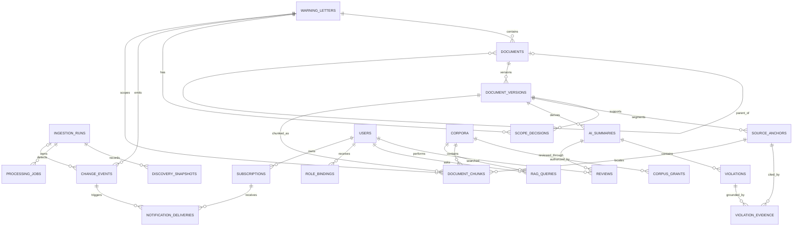

# Core data model

The SQL source of truth is [`contracts/schema.sql`](../../contracts/schema.sql). This view emphasizes provenance, immutable versions, review, and pre-retrieval authorization.

## Invariants

- `warning_letters` is the stable lifecycle identity; warning, response, and closeout records are separate `documents`.
- `document_versions`, `scope_decisions`, AI outputs, evidence, reviews, lifecycle events, and audit events are append-only records.
- A current user-visible letter must be `IN_SCOPE_DRUGS`, contain exact normalized class `Drugs`, and have `current_in_scope=true`.
- A retrievable chunk must also be active in an authorized corpus. The scope-safe SQL view is a base; effective `corpus_grants` are joined before either lexical or vector search.
- Raw object keys are private references. Integrity is checked with retained SHA-256 values; browsers receive authorized time-limited downloads or official FDA links.

