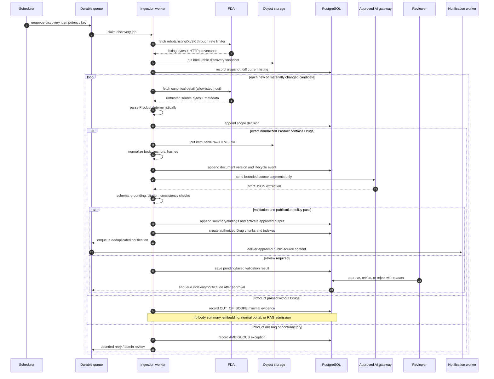

# Ingestion and publication sequence

## Idempotency boundaries

| Stage | Key |
|---|---|
| Discovery | `source_url + export_sha256` |
| Scope | `canonical_url + source_version_id + scope_rule_version` |
| Fetch | `canonical_url + expected_source_state_hash` |
| Parse | `document_version_id + parser_version` |
| Summarize | `document_version_id + model_id + prompt_version + schema_version` |
| Embed | `document_version_id + embedding_model_id + chunker_version` |
| Notify | `change_event_id + subscription_id` |

Only a changed normalized document-body hash creates a new source version. ETag changes alone update retrieval provenance.

