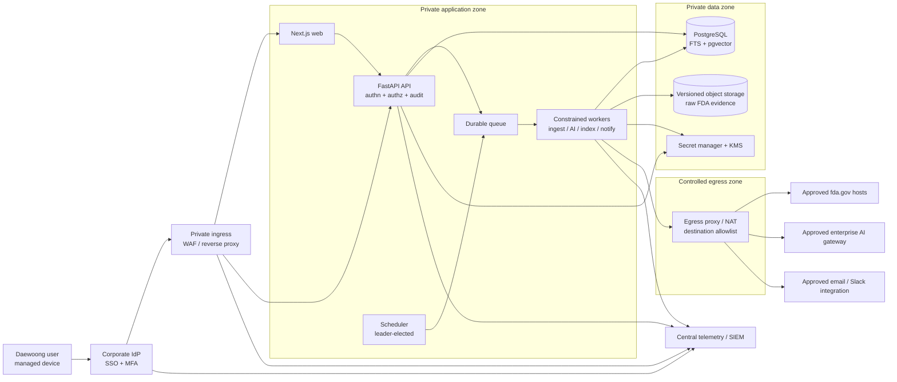

# Logical architecture

This is the starter deployment boundary for the internal FDA Drug Warning Letter Intelligence service. Production substitutions must preserve the same trust boundaries.

## Boundary rules

- Only ingress may reach web/API; PostgreSQL, queue, objects, and secrets have no public endpoint.
- Backend authorization is independent of frontend navigation. Corpus grants and `Product: Drugs` are applied before FTS/vector retrieval.
- FDA bytes and attachments are untrusted input. Raw HTML is never rendered directly.
- Workers can reach only approved FDA, AI, and notification destinations. They cannot reach sensitive manufacturing/QC networks.
- The model has no shell, browser, arbitrary URL, filesystem, or database tool.
- Raw sources and normalized source versions are authoritative; summaries and embeddings are versioned derivatives.

## Availability baseline

- At least two stateless API/web replicas in production.
- Managed PostgreSQL HA/PITR, versioned object storage, and a persistent queue.
- Health probes, rolling deployment, bounded graceful shutdown, and scheduler leader election.
- FTS/vector data is rebuildable from retained source versions. Proposed service goals are 99.5% monthly availability, RPO at most 15 minutes, and RTO at most four hours, subject to enterprise approval.

